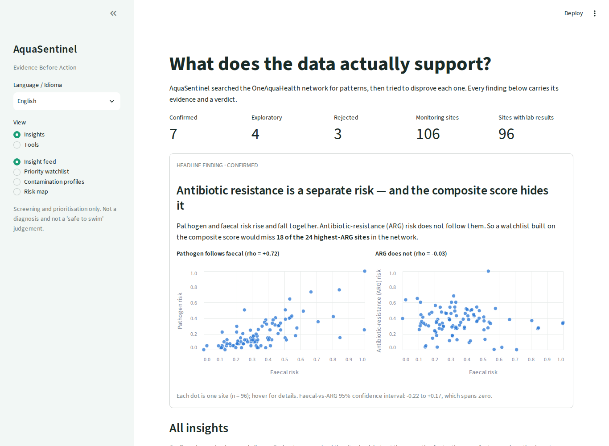
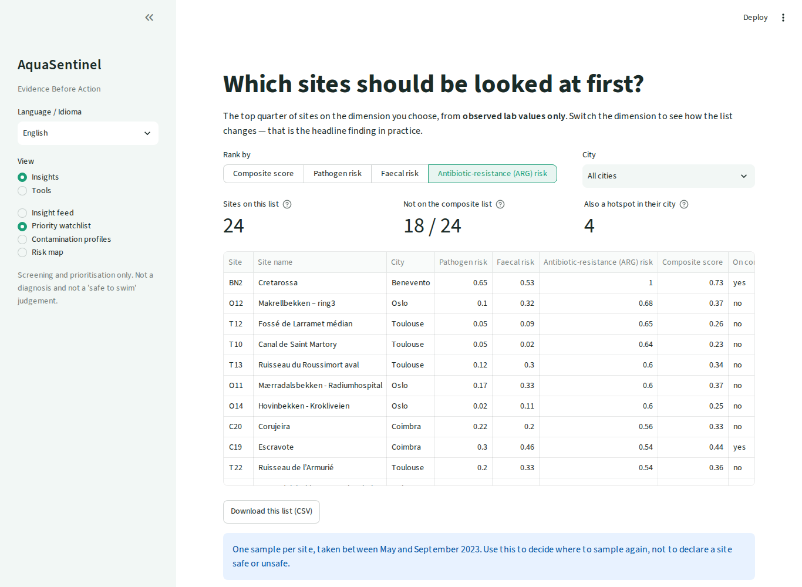
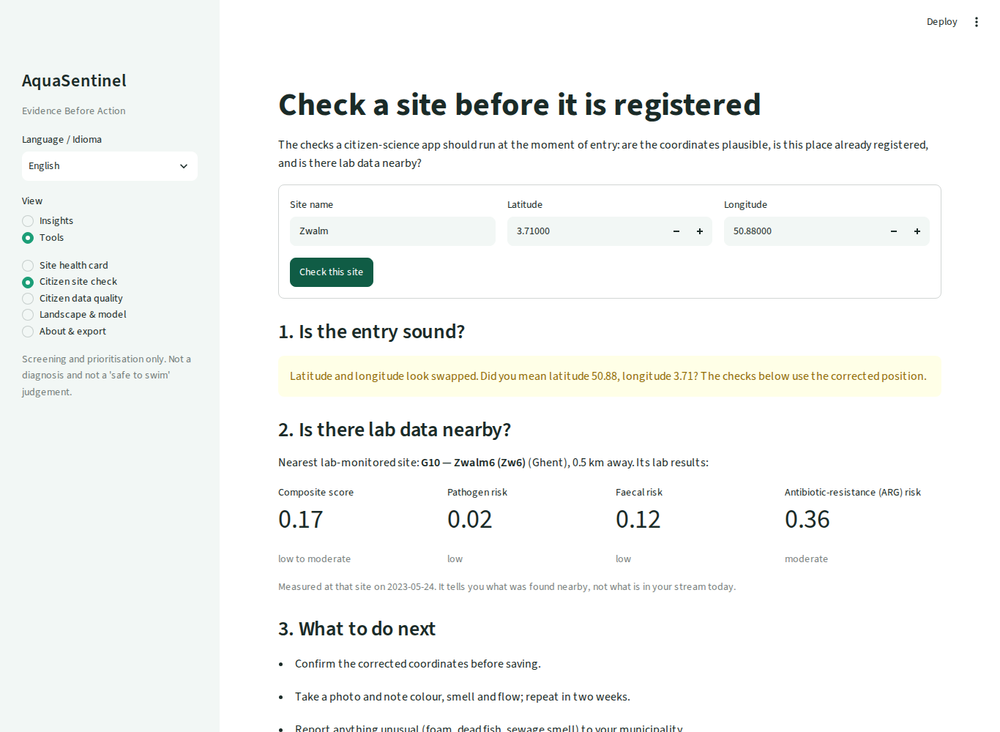

# AquaSentinel

**Evidence Before Action — tested insights for urban stream health.**

AquaSentinel searches the OneAquaHealth stream data for patterns, tries to disprove
each one, and then says what evidence to collect next. Every insight is shown with its
evidence and one of three verdicts: **supported**, **exploratory** or **rejected**.
No sample, no risk score; no evidence, no insight.

**Discover → Challenge → Decide → Collect.** 14 candidate insights tested, 7 supported,
and 6 false leads stopped (3 rejected, 3 downgraded to exploratory) before they reached
a decision. The Evidence gap page turns what is left uncertain into 31 sites to sample again.

Built for the **OneAquaHealth IEEE Global Hackathon 2026**.
**Track: Data-to-Insight.** It also addresses AI-Supported Assessment (explainable
checks on citizen data) and Digital Health Standards (SensorThings / GeoJSON / FHIR API).



## The headline finding

**ARG risk behaves differently from faecal risk, and a composite score can miss high-ARG sites.**

- Pathogen and faecal risk move together: Spearman ρ = +0.72 (95% CI +0.60 to +0.82),
  positive in all five cities.
- Antibiotic-resistance-gene (ARG) risk shows no detectable association with faecal risk: ρ = −0.03
  (95% CI −0.22 to +0.17), and 0.00 once the city effect is removed.
- So the composite top quarter **leaves out 18 of the 24 highest-ARG
  sites**. Example: T10 in Toulouse has ARG 0.64 but a composite of only 0.23.
- The same happens between cities: on the composite they are not clearly different
  (p = 0.060), but split by component they are (pathogen p < 0.001, faecal and ARG
  p = 0.029 after Holm correction), in opposite directions. Coimbra is highest for
  pathogen, Oslo for ARG.

Antimicrobial resistance is a core One Health concern, and faecal indicators are the
usual monitoring proxy. In this network that proxy does not track ARG.

One caveat the engine found itself: inside cities, ARG is weakly related to pathogen
risk (ρ = +0.22). The supported claim is "no detectable association with faecal risk",
not "independent of everything".

## What the engine found

`make insights` discovers 14 insights from the raw data: **7 supported, 4 exploratory,
3 rejected.**

| Verdict | Insight | Evidence |
|---|---|---|
| Supported | No detectable association between ARG and faecal risk | ρ = −0.03, 95% CI −0.22 to +0.17, n = 96 |
| Supported | Cities differ on each risk dimension; the composite hides it | Kruskal–Wallis, Holm-adjusted: p < 0.001, 0.029, 0.029 |
| Supported | Two observed risk profiles emerge (31 elevated, 65 low) | silhouette 0.38, p = 0.015 against a correlated no-cluster null |
| Supported | 6 sites where the composite hides one very high component | arithmetic on observed values |
| Supported | 9 sites far above their own city's norm (C5, BN2, G9, …) | within-city z ≥ 1.5 |
| Supported | Across these five cities, landscape features do not predict risk in an unseen city | model beats the baseline for 0 of 4 targets |
| Supported | 42% of citizen site registrations need fixing | 30 of 71, deterministic rules |
| Exploratory | Vegetation fragmentation within 250 m | ρ = +0.28; passes the city check; family-wise p = 0.90 |
| Exploratory | Distance to wastewater stations | ρ = −0.22; passes the city check; family-wise p = 0.45 |
| Exploratory | Landscape fragmentation within 1500 m | ρ = −0.20; passes the city check; family-wise p = 0.34 |
| Exploratory | 3 high-risk sites the landscape candidates do not explain | BN4, BN15, T6 |
| Rejected | Distance to crop fields | ρ = −0.22 overall, −0.06 inside cities |
| Rejected | Distance to hospitals | ρ = −0.21 overall, −0.06 inside cities |
| Rejected | Vegetation fragmentation within 500 m | ρ = +0.20 overall, +0.01 inside cities |

### How an insight is challenged

1. **City confounding.** Associations are recomputed inside cities, with the city mean
   removed from both variables. An association that only reflects differences between
   cities is rejected.
2. **Multiple testing.** 59 landscape features are screened, so the best few will look
   significant by chance. Risk is shuffled between sites of the same city 500 times; the
   best of 59 reaches |ρ| ≥ 0.32 in 5% of shuffles. No association in this data clears
   that bar, so the three that pass the city check are labelled exploratory, not supported.
3. **Structure versus correlation.** The observed risk profiles are compared with 200
   simulated datasets that keep the same correlations but contain no clusters, and the
   simulation gets the same freedom to pick the number of clusters.
4. **Confidence intervals.** The headline "no association" claim rests on a bootstrap
   interval, not on a non-significant p-value.

Details: [`docs/insights.md`](docs/insights.md).

## What the app does

**Insights**
1. **Insight feed** — the headline finding drawn as composite rank against ARG rank
   (18 of the top 24 ARG sites sit outside the composite top 24), then the correlations
   behind it. Below, every insight as an evidence card, grouped as supported findings,
   exploratory hypotheses, and false leads stopped. Each card gives the statistic,
   sample size, what cannot be concluded, how it was challenged, and what would change
   our mind.
2. **Evidence gap** — what to measure next. For every testable insight it states how
   much data would change the verdict: about 410 sites in total (96 today) to pin the
   ARG–faecal link to ±0.10, 260 to 505 sites to settle an exploratory landscape signal,
   and over 4,000 for a rejected one, so those are closed. Then where to collect it: 31
   sites to visit again (32% of the network), each listed with the insights it would
   test; 5 test two at once. Downloadable as CSV.
3. **Priority lens** — the top quarter of sites on the dimension you choose, from
   observed lab values only. Switch from composite to ARG and 18 of 24 sites change.
   Downloadable as CSV.
4. **Observed risk profiles** — the two groups, with charts showing that they separate
   on pathogen and faecal risk and overlap on ARG.
5. **Risk map** — the monitored sites coloured by any risk dimension or nitrate, with a
   zoom per city and an optional layer of cleaned citizen sites.

**Tools**
6. **Site health card** — observed values for one site, and a warning when the
   composite understates it.
7. **Citizen site check** — the checks an app should run at the moment of entry: swapped
   coordinates (with the fix), an existing registration within 25 m ("add a visit
   instead"), and whether a lab-monitored site is within 2 km. Nothing is estimated for
   a stream that has not been sampled.
8. **Citizen data quality** — the 71 real registrations: 10 test names, 3 swapped
   coordinates, 19 duplicates that are really 5 places. Each flag has a suggested fix,
   and the cleaned registry (47 sites) downloads as CSV. 34 of those 47 are more than
   50 km from any lab-monitored site; that is noted, not flagged, because citizen science
   is global.
9. **Landscape & model** — the leave-one-city-out test that shows landscape data does
   not predict risk in a new city.

The interface is in English and Portuguese.





## What we removed, and why

An earlier version had a scenario simulator and a risk estimate for unsampled citizen
sites. Both rested on the landscape model. Leave-one-city-out validation showed the
model does not beat a "predict the average" baseline for any target (composite error
0.107 against 0.103), and its faecal component selects no features at all. So both
features were removed. That is the product's own rule applied to itself. See
[`docs/self_review.md`](docs/self_review.md).

## Quickstart

```bash
pip install -r requirements.txt      # or: make install

make profile     # join coverage + citizen data-quality report
make analyze     # associations, leave-one-city-out validation, model
make insights    # discover -> challenge -> outputs/insights.json
make test        # unit tests

make app         # dashboard -> http://localhost:8501
make api         # API       -> http://localhost:8000/docs
```

`make run` rebuilds everything and opens the app.
Docker: `docker build -t aquasentinel . && docker run -p 8501:8501 aquasentinel`.
`python scripts/fetch_data.py` re-downloads the raw CSVs from the public API.

Deployment steps for Streamlit Community Cloud are in [`docs/DEPLOY.md`](docs/DEPLOY.md).

## Interoperability API

`api/main.py` (FastAPI) serves the same data in standard shapes:

| Endpoint | Content |
|---|---|
| `/v1.1/Things`, `/v1.1/Observations` | OGC SensorThings-shaped sites and risk observations |
| `/geojson/sites` | GeoJSON FeatureCollection |
| `/fhir/Observation/{siteCode}` | HL7 FHIR R4 Observation (demonstration mapping) |
| `/insights?status=supported` | every insight with evidence and verdict |
| `/plan` | the next sampling campaign: sites to re-sample and the data each verdict needs |
| `/citizen/quality` | citizen registrations with flags and suggested fixes |

## Repo layout

```
aquasentinel/
├── app/app.py            # Streamlit app
├── api/main.py           # FastAPI: SensorThings / GeoJSON / FHIR / insights
├── src/aquasentinel/     # data, quality, features, insights, model, explain, i18n
├── scripts/              # fetch_data, run_profile, run_analysis, compare_models, run_insights
├── tests/                # pytest: engine, validator, model validation, API, translations
├── data/raw/             # 8 source CSVs
├── outputs/              # insights.json, cv_results.json, reports, model
└── docs/                 # insights, model card, data dictionary, architecture,
                          # Devpost text, video script, judging map, self-review
```

## Documentation

- [Insight engine](docs/insights.md) · [Model card](docs/model_card.md) ·
  [Data dictionary](docs/data_dictionary.md)
- [Architecture](docs/architecture.md) · [Judging-criteria map](docs/judging_map.md)
- [Devpost write-up](docs/devpost.md) · [Demo video script](docs/video_script.md) ·
  [Self-review](docs/self_review.md)

## Limits

- The data is a snapshot: one lab sample per site, and each city was sampled in a
  single campaign (Ghent and Toulouse in May, Coimbra and Benevento in June and July,
  Oslo in September 2023). City and season cannot be separated, and
  nothing here is a forecast.
- The risk values are relative 0 to 1 indices defined by OneAquaHealth. They rank
  sites; they are not probabilities of harm.
- Screening and prioritisation only. Not a diagnosis and not a "safe to swim" judgement.

## Data and credit

Data comes from the **OneAquaHealth** project (EU-funded) through its public Resilience
Map API. Data rights remain with OneAquaHealth and its partners. Code is MIT-licensed
(see [LICENSE](LICENSE)). No personal data is used.
