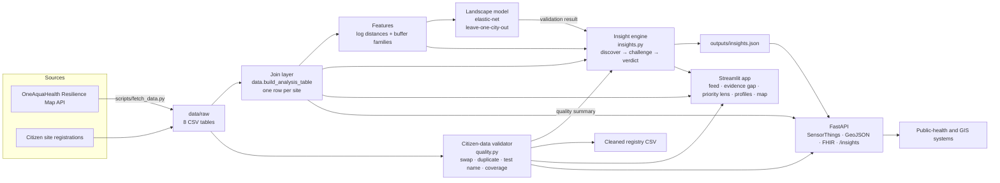

# Architecture

## Flow in words
1. **Ingest.** `scripts/fetch_data.py` downloads the eight source tables from the public
   Resilience Map API into `data/raw/`.
2. **Join.** `data.build_analysis_table()` produces one row per site: risk values,
   nitrate, landscape features and climate context. Missing joins stay empty.
3. **Validate citizen data.** `quality.validate_submissions()` applies deterministic
   rules, using the monitored sites as its reference set. `assess_new_submission()` runs
   the same rules on one entry at the moment of registration.
4. **Model.** One elastic-net per risk component, validated by leaving each city out in
   turn. Its only product role is to supply the validation result and exploratory context.
5. **Discover and challenge.** `insights.discover_all()` runs every discovery, challenges
   each one (city check, family-wise permutation, simulated null, bootstrap interval, Holm
   correction) and attaches a verdict.
6. **Serve.** The same results reach users three ways: the Streamlit app, the API, and
   files in `outputs/`.

## Design choices
- **One place for each rule.** Join logic lives in `data.py`, validation in `quality.py`,
  statistics in `insights.py`. The app and the API import them; neither re-implements
  anything.
- **Deterministic.** Every resampling test is seeded. A test asserts that two runs give
  identical insights.
- **Fails safe on deploy.** If the saved model file was written by a different
  scikit-learn, the app refits it from the raw data. The solver settings work with both
  the old and the new scikit-learn argument names.
- **Small dependencies.** No GPU, no database, no API keys. The map uses OpenStreetMap tiles.

## Scaling up
- **A new city** is new rows in the same tables. The engine reruns unchanged, and with
  more cities the leave-one-city-out test becomes more informative.
- **Repeated sampling** turns the snapshot into a series. The join layer would key on
  site and date, and the same challenge logic applies to trends. The SensorThings
  `Observations` shape already carries a time for each result.
- **More citizen registrations.** Duplicate detection compares all pairs, which is fine
  for thousands of entries; beyond that a spatial index replaces the pairwise step.
- **Other systems** read the data through OGC SensorThings-shaped JSON, GeoJSON and an
  HL7 FHIR Observation mapping, so no custom integration is needed.
