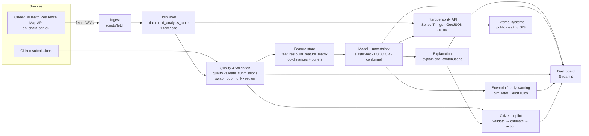

# Architecture

## Flow in words
1. **Ingest** the eight source tables from the public Resilience Map API.
2. **Join** everything to one row per site on the site code.
3. **Validate** citizen submissions with deterministic, explainable rules.
4. **Feature store** builds log-distances and keeps collinear buffer families.
5. **Model + uncertainty**: elastic-net per component, leave-one-city-out validation,
   split-conformal intervals.
6. **Explanation** turns coefficients into plain-language drivers.
7. **Serve** three ways: a Streamlit dashboard (map, health card, drivers, scenario,
   copilot, data-quality), a standards-aligned **API** (SensorThings/GeoJSON/FHIR),
   and an **alert feed** from the scenario engine.

## Real-time path (design, for when time-series arrives)
Replace the batch ingest with a **SensorThings ingestion** of sensor/lab feeds; the
same join → feature → model → alert chain runs incrementally, and the scenario
thresholds become live triggers. The current data is cross-sectional, so this path
is architected but not yet fed.
